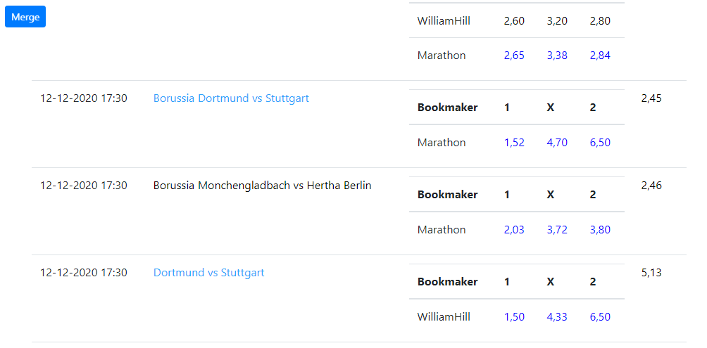

The goal of the project is to parse several bookmaker sites and provide information in a form convenient for analysis.

First you need to select one or more bookmakers and a sport and click the sample button.
Parsing and selection of events will be performed in the following form.

Now you can click the analyze button. The following presentation will turn out. 
In this table, you can combine events into groups (merge). 
To do this, you need to click the desired events, their color will change to blue. 
If more than one event is selected, the merge button will appear.

After clicking the merge button, the selected events will be merged. 
After the first run, replace in the last line (spring.jpa.hibernate.ddl-auto = create)
'create' to 'none' in the application.properties file to preserve the command name synonyms.

The best odds in the event group are highlighted in blue. 
The bookmaker's profit is calculated in the Profit column. 
The lower the value, the better. Ideally, it should be negative))) 
Profit less than 2% is highlighted in red.
